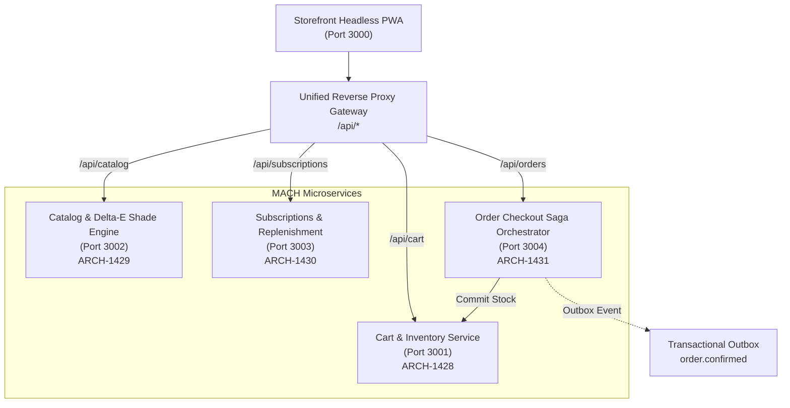

# Aura Cosmetics - Enterprise MACH Composable Platform

[](https://jira.example.com/browse/ARCH-1427)
[](#architecture)
[](#automated-testing)

A next-generation enterprise MACH-composable D2C commerce platform developed for Aura Cosmetics under **Epic ARCH-1427** and its child stories:
- **ARCH-1428**: High-Concurrency Flash-Sale Cart & Redis Redlock Distributed Inventory Reservation
- **ARCH-1429**: High-Cardinality Product Catalog & Faceted Shade Matching Engine
- **ARCH-1430**: Automated Cosmetic Replenishment Subscriptions & Self-Service Regimen Portal
- **ARCH-1431**: Order Checkout Saga Orchestration & PCI-DSS Tokenized Payment Capture
- **ARCH-1432**: Aura Cosmetics Headless PWA Storefront & Unified API Gateway

---

## Architecture Overview



---

## Microservices & Jira Ticket Breakdown

### 1. ARCH-1428: Cart & Distributed Inventory Reservation Service
- **Directory**: `services/cart-service`
- **Port**: `3001`
- **Features**:
  - Redis Redlock distributed lock simulation on high-concurrency SKU checkout.
  - 10-minute (600s) TTL key reservation with `res_tok_<uuid>` tokens.
  - Concurrency collision handling on flash-sale spikes (tested with 50 concurrent requests competing for stock = 1: exactly 1 wins HTTP 201, 49 receive HTTP 409 `INSUFFICIENT_INVENTORY`).
  - Automatic expiration reconciliation restoring unpurchased stock and returning HTTP 410 Gone for expired tokens.

### 2. ARCH-1429: Catalog & Shade Matching Engine
- **Directory**: `services/catalog-service`
- **Port**: `3002`
- **Features**:
  - High-cardinality catalog featuring 55 shades across 6 depths (`FAIR`, `LIGHT`, `MEDIUM`, `TAN`, `DEEP`, `RICH`), 4 undertones (`WARM`, `COOL`, `NEUTRAL`, `OLIVE`), and 3 finishes (`DEWY`, `MATTE`, `SATIN`).
  - Algorithmic shade matching engine using CIE $L^*a^*b^*$ color space and Delta-E Euclidean color distance calculation:
    $$\Delta E^*_{ab} = \sqrt{(\Delta L^*)^2 + (\Delta a^*)^2 + (\Delta b^*)^2}$$
  - Exact target verification: matching `#fae7d0` with `WARM` undertone and `DEWY` finish maps to `AB-FDN-100W` with 100% confidence score.
  - Hex regex validation (`^#[0-9a-fA-F]{6}$`): invalid hex strings (e.g. `#ZZ9999`) return HTTP 400 Bad Request with code `INVALID_HEX_FORMAT`.
  - Discontinued shade handling: returns replacement recommendation.

### 3. ARCH-1430: Replenishment Subscriptions & Regimen Portal
- **Directory**: `services/subscription-service`
- **Port**: `3003`
- **Features**:
  - Recurring cosmetic replenishment subscriptions with 30, 45, 60, and 90-day frequencies and automatic 15% subscriber discounts.
  - `POST /v1/subscriptions/:id/skip`: advances `next_billing_date` by `+frequency_days` without status degradation.
  - `POST /v1/subscriptions/:id/swap`: self-service shade swapping for future shipments without resetting subscription tenure.
  - Smart dunning retry lifecycle: payment failures mark status `PAST_DUE` and schedule retries at Day 1, 3, 5, 7 (+72h intervals).

### 4. ARCH-1431: Order Checkout Saga Orchestration & PCI-DSS Capture
- **Directory**: `services/order-service`
- **Port**: `3004`
- **Features**:
  - Mandatory `Idempotency-Key` header validation (missing key returns HTTP 400 `MISSING_IDEMPOTENCY_KEY`).
  - Active reservation token verification before payment capture.
  - Tokenized PCI-DSS payment capture simulation (`pm_card_visa_tok`).
  - Inventory commitment via Cart Service.
  - Idempotent replay: duplicate submission of the same key returns cached order response with HTTP 200 OK without re-capturing or double-deducting.
  - Transactional Outbox Pattern: records `order.confirmed` event within the same ACID transaction for event streaming.

### 5. ARCH-1432: Headless PWA Storefront & API Gateway
- **Directory**: `storefront`
- **Port**: `3000`
- **Features**:
  - Aura Cosmetics Design Tokens: Alabaster `#F8F5F2`, Dusty Rose `#D8B2A9`, Soft Black `#2D2D2D`, and Manrope typography.
  - 10-minute live cart reservation countdown timer with pulsing indicator.
  - Interactive Shade Finder Quiz wizard communicating with the Delta-E matching engine.
  - 50+ shade swatch matrix with one-time vs. replenishment regimen toggle.
  - 1-Click checkout and Stripe Elements checkout simulation.
  - Self-service subscription regimen management portal.

---

## Quickstart

### 1. Launch the Full Platform
```bash
python start_platform.py
```
Visit **`http://localhost:3000`** in your browser.

### 2. Run Acceptance Test Suite
```bash
python test/run_all_tests.py
```
All 5 Jira test suites will execute and validate against acceptance criteria.
